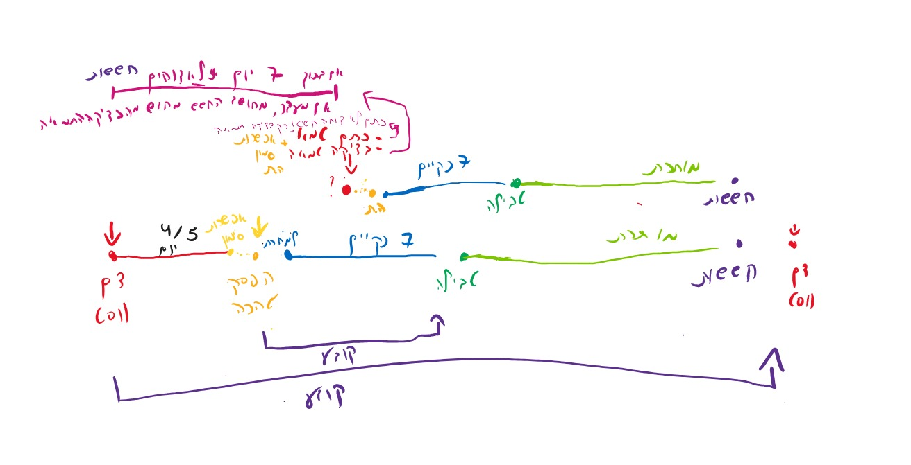

# Mikveh4U

A friendly mobile and web app that helps Jewish women keep track of the laws of family purity (הלכות נדה וטהרה) according to their tradition — and find the nearest Mikveh when it's time to immerse.



---

## What is this app?

The Jewish laws of family purity have many dates to remember each month:

- when the period (וסת) started,
- which days are considered "Niddah" (ימי נידה),
- when she may begin checking for the "Hefsek Tahara" (הפסק טהרה),
- the seven clean days (שבעה נקיים),
- the "concern" days (ימי פרישה / חששות) such as Onah Beinonit, Veset HaChodesh, etc.
- and finally the night she may go to the Mikveh.

These dates depend on the family's tradition — **Chabad** or **Sephardi**. The Sephardi option supports two calculation methods: **Rav Ovadia Yosef** and **Rav Mordechai Eliyahu**.

**Mikveh4U does all of this counting for you.** You enter the events you observed (for example: "I saw a period today" or "I made a Hefsek Tahara today"), and the app marks the upcoming relevant days on a calendar with clear Hebrew explanations.

It also uses your phone's location to show the closest Mikveh on a map.

---

## What can it do?

- **Pick your tradition** – choose Chabad, Sephardi according to Rav Ovadia Yosef, or Sephardi according to Rav Mordechai Eliyahu. The calculations change accordingly.
- **A clean Hebrew calendar** – shows both the Hebrew date and the Gregorian date.
- **Add an event with one tap**, for example:
  - וסת (start of period)
  - הפסק טהרה
  - בדיקה טמאה
  - כתם טמא
- **Automatic counting**, the app fills in:
  - the days of Niddah after the period,
  - the day from which one may start checking for Hefsek Tahara,
  - the seven clean days,
  - the days of "concern" for next month (Veset HaChodesh, Onah Beinonit).
- **Find a nearby Mikveh** – the app detects your location and shows the closest city / Mikveh on Google Maps.
- **Works on phone and web** – installable as an Android / iOS app (via Capacitor) or used in a browser.
- **Data stays on your device** – events are saved locally using Ionic Storage. Nothing personal is sent to a server.

---

## How it works (in plain words)

1. You open the app and choose your tradition (Chabad / Sephardi - Rav Ovadia Yosef / Sephardi - Rav Mordechai Eliyahu).
2. You see a calendar (Hebrew + Gregorian).
3. When something happens (period, Hefsek Tahara, etc.) you tap the day and add the event.
4. The app calculates all the rules that follow from that event for your tradition and paints them onto the calendar with short Hebrew labels like:
   - "יום 1 לנידה"
   - "אפשר להתחיל לבדוק הפסק טהרה"
   - "יום 3/7 נקיים"
   - "חשש בינונית"
5. When you need a Mikveh, the app uses your phone's GPS to suggest the nearest one.

All your events are kept on your own phone.

---

## Under the hood (for the curious / developers)

- **Framework:** [Ionic](https://ionicframework.com/) + [Angular](https://angular.dev/) (standalone components).
- **Mobile packaging:** [Capacitor](https://capacitorjs.com/) for Android and iOS.
- **Hebrew dates & locations:** [`@hebcal/core`](https://github.com/hebcal/hebcal-es6), `@hebcal/cities`, `jewish-date`.
- **Maps:** Google Maps JavaScript SDK (`@angular/google-maps`).
- **Location:** `@capacitor/geolocation`.
- **Local storage:** `@ionic/storage-angular`.
- **Hosting (web):** Firebase Hosting.

Main pieces of code:

- `src/app/pages/approaches/` – the main screen (calendar + event input).
- `src/app/services/cal.service.ts` – the halachic logic: turns an input event (Veset / Hefsek Tahara / …) into all the resulting days on the calendar, per tradition.
- `src/app/services/location.service.ts` – GPS + closest city lookup.
- `src/app/services/cache.service.ts` – stores the user's events locally.

---

## Running the app yourself

You need [Node.js](https://nodejs.org/) (v18+) installed.

### 1. Install dependencies

```bash
npm install
npm install -g @ionic/cli   # one-time, installs the `ionic` command
```

### 2. Run in the browser (development)

```bash
ionic serve
```

This opens the app at <http://localhost:8100>.

### 3. Build for production (web)

```bash
npm run build
```

The compiled site is placed in `www/`.

### 4. Deploy the website to Firebase Hosting

```bash
firebase deploy --only hosting:mikveh4u
```

### 5. Build the Android app

```bash
npx cap sync
ionic capacitor build android
```

Run it on a connected Android device with live reload:

```bash
ionic cap run android -l --external --consolelogs
```

To inspect the device's web view from Chrome, open: `chrome://inspect/#devices`

---

## Running the tests

The halachic-calculation logic in `src/app/services/cal.service.ts` (Hefsek Tahara, the seven nekiim, Mikveh day, the niddah chain, the hashashot of Onah Beinonit / Veset HaChodesh, and the cascade-delete data integrity rules) is covered by unit tests in `src/app/services/cal.service.spec.ts`.

The project uses Karma + Jasmine via the Angular CLI.

### Watch mode (during development)

```bash
npm test
```

Opens a Chrome window and re-runs the tests on every save.

### One-shot run (CI / pre-commit)

```bash
CHROME_BIN=$(which google-chrome) npx ng test --browsers=ChromeHeadlessNoSandbox --watch=false
```

The `ChromeHeadlessNoSandbox` launcher is defined in `karma.conf.js` and is the one to use on Linux / CI environments where Chrome cannot run with the default sandbox.

### Running a single spec file

```bash
CHROME_BIN=$(which google-chrome) npx ng test --browsers=ChromeHeadlessNoSandbox --watch=false --include='**/cal.service.spec.ts'
```

### Adding new tests

- Co-locate the spec next to the file under test (e.g. `foo.service.ts` ↔ `foo.service.spec.ts`).
- For services that inject `LocationService`, `CacheService`, or `ApproachService`, mirror the lightweight stubs used in `cal.service.spec.ts` rather than booting the real services (which depend on Capacitor / Storage / Geolocation).
- Use UTC-noon dates (`new Date('2025-01-10T12:00:00Z')`) when constructing input events to avoid DST-related off-by-one day diffs.

---

## Disclaimer

This app is a **helper tool only**. It is not a substitute for asking a Rav. For any real-life halachic question please consult a qualified Rabbi.
